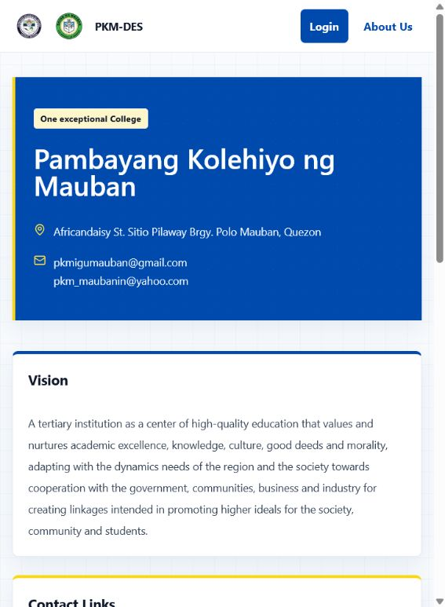
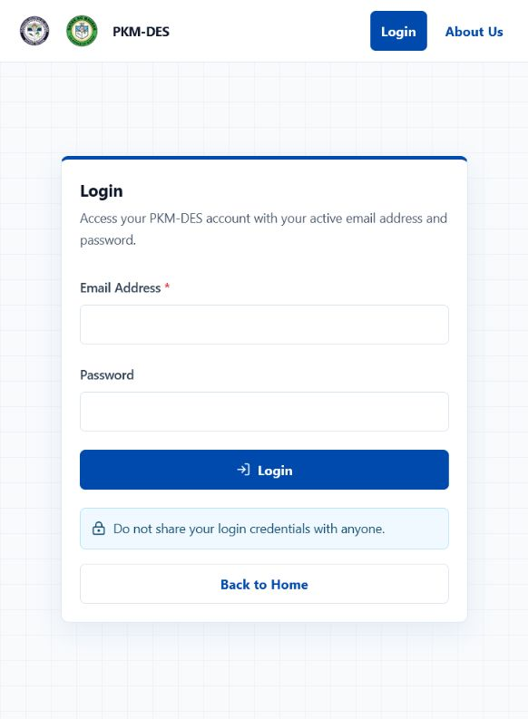
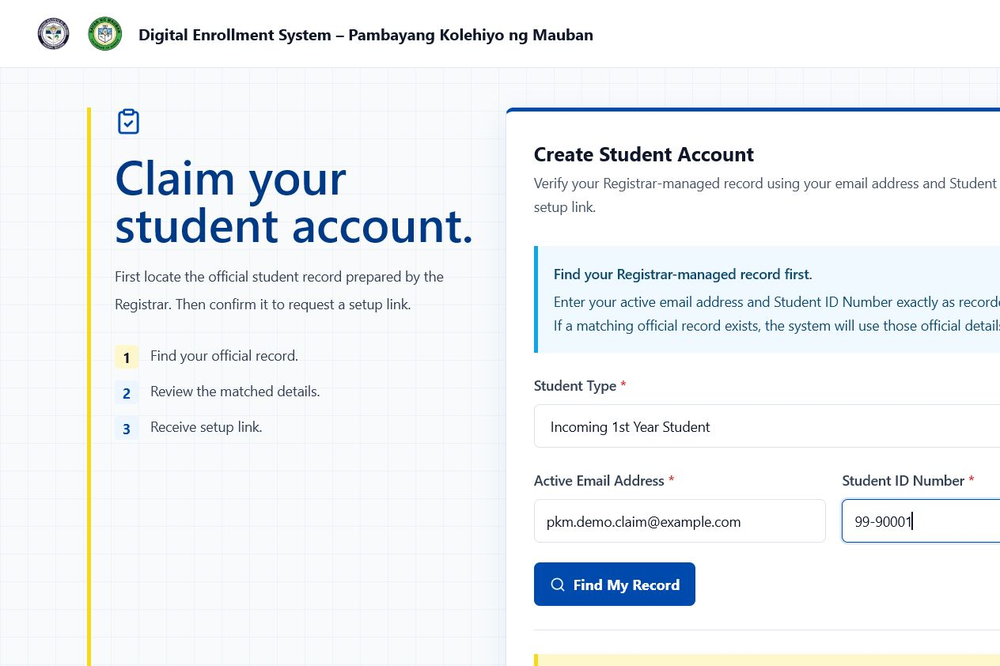
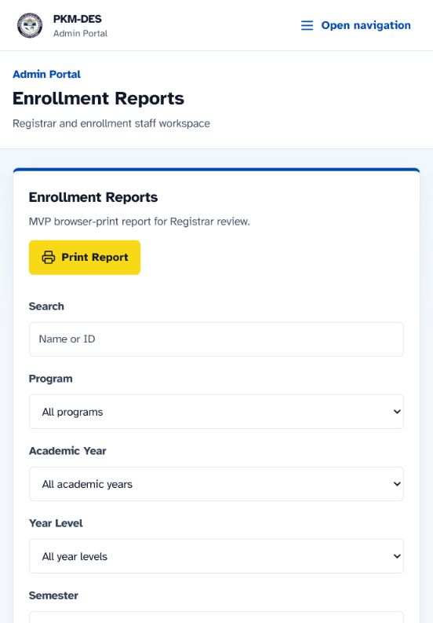

# PKM-DES Research MVP Demo Guide

This guide is for research presenters, advisers, client reviewers, and authorized preview operators. It walks through the implemented PKM-DES demonstration path using fictional data.

> PKM-DES is a research-presentation MVP and client preview. It is not an official enrollment service, a production institutional system, or a replacement for the Registrar's current process.

## 1. Before The Demo

### Use a safe preview

- Use the local development server or the authorized client-preview deployment.
- Use only fictional or anonymized records. Never enter real student data.
- Keep active preview credentials private. They are intentionally not printed in this guide.
- Use a dedicated preview or test Supabase project. Do not run demo reset or mutating smoke workflows against institutional data.
- Confirm the active academic term displayed by the application before presenting it. The current feature branch uses the client workbook term `AY 2025-2026`, `2nd Semester`; a deployed preview may show another configured term if it has not yet been redeployed from this branch.

### Start locally

```bash
npm install
npm run dev
```

Open `http://localhost:3000`. If the port is already in use, stop the old Next.js process or use the port printed by the server. Restart the server after changing `.env.local`; Next.js reads environment variables at startup.

For local login, the machine must be able to reach the configured Supabase project over HTTPS. A local `Invalid email or password` message can also represent a failed server-side Supabase request because the MVP deliberately returns a safe generic auth error.

## 2. Public Walkthrough

### Step 1: Open Home

Open `/` and introduce the system as a proposed digital enrollment workflow. Point out the two primary actions: login and student account creation.


*Figure 1. Public home page with the PKM and Municipality marks, account actions, and enrollment-process overview.*

### Step 2: Open About Us

Select **About Us**. Show the school identity, vision, mission, goals, contact information, and approved public links supplied by the client source material.



*Figure 2. About Us page using source-grounded PKM information.*

### Step 3: Open Login

Select **Login**. Explain that the same login entry routes an active student to the Student Portal and an active Registrar/Admin account to the Admin Portal.



*Figure 3. Login form. Do not type or display credentials while presenting screenshots.*

## 3. Student Account Claim Walkthrough

The student does not invent the official profile during account creation. The Registrar first creates or verifies the official student record. The student then claims that record using the exact active email address and Student ID Number.

### Step 4: Open Create Student Account

Open `/create-account`. Explain the three stages shown on the page:

1. Find the official record.
2. Review the matched details.
3. Receive the setup link or complete the configured account path.


*Figure 4. Account-claim instructions before a record lookup.*

### Step 5: Enter a fictional claim record

For a safe demonstration, use a fictional record prepared in the dedicated preview database. The repository's repeatable claim-only example is:

| Field | Fictional value |
| --- | --- |
| Student Type | Incoming 1st Year Student |
| Active Email Address | `pkm.demo.claim@example.com` |
| Student ID Number | `99-90001` |

Select the student type, enter both matching identifiers, and select **Find My Record**. Do not use email-only or Student-ID-only matching.



*Figure 5. Filled claim form using fictional `example.com` data. The screenshot does not contain an active credential.*

If the official record is found, review the masked official details. Continue only when the record and selected student type agree. Do not photograph or publish real student details.

### Step 6: Complete the account path

The preview may use a private setup-link or password path depending on its environment configuration. Email delivery is disabled by default in the research MVP. Never claim that an email was delivered unless the authorized preview operator has separately verified that workflow.

After account setup, use the private student credential to log in. The guide does not include a password or active student identity.

## 4. Student Portal Walkthrough

These steps require an active fictional student account in the authorized preview. The student account must be created or claimed before these routes can be shown.

### Step 7: Student Dashboard

Open `/student/dashboard` after login. Show:

- student information from the authenticated profile
- current enrollment status
- the status-based primary action
- links to Subject List, Online Enrollment, Grades, Class Schedule, Balances, and Account

The dashboard is not the source of truth for enrollment eligibility. Online Enrollment re-loads the authenticated student record on the server.

### Step 8: Subject List

Open `/student/subjects`.

1. Choose a program.
2. Choose a year level.
3. Review the tables grouped by year level and semester.
4. Distinguish curriculum references from the client workbook's course offerings.

The program catalog contains multiple programs. The current workbook-derived offering snapshot covers several programs, while automatic online enrollment is available only for program/year combinations with a complete active standard-load configuration. Incomplete source combinations show an unavailable state; no rows are invented.

Students do not pick individual subjects in this MVP.

### Step 9: Online Enrollment

Open `/student/enrollment`.

1. Confirm the read-only program, year level, student type, academic year, and semester.
2. Review the configured standard course load when one is available.
3. Check **I certify that the information provided is correct**.
4. Select **Submit Enrollment**.

The browser submits only the certification. The server derives student identity, program, year level, student type, term, and subjects from trusted server-side data. The database creates the enrollment and attached subject rows atomically.

Incoming 1st Year, Old, Continuing, and Regular students can use the automatic standard-load path when their program/year load is configured. Transferee and Irregular Student loads require Registrar-managed subject assignment and are not automatically submitted by this MVP.

### Step 10: Enrollment Status

Open `/student/enrollment-status` after submission. Show the pending message first. After Registrar review, show the approved or rejected result and any safe rejection remarks.

An approved request can link to the draft registration form. The form is a browser-print MVP output, not an official Certificate of Registration.

### Step 11: Student Account

Open `/student/account` to review the account information and use the password-change form. Students cannot reset another student's password; they must contact the Registrar.

Grades, Class Schedule, and Balances are visible only as placeholders or empty states unless later data and approved institutional rules are supplied.

## 5. Registrar/Admin Walkthrough

Use a private active Registrar/Admin credential. Never place it in screenshots or committed documentation.

### Step 12: Admin Dashboard

Open `/admin/dashboard`. Start with the pending queue, then use the workflow links for official records and reporting.


*Figure 6. Registrar dashboard from the authorized deployed preview. Counts represent submitted enrollment requests, not official student records.*

The dashboard count cards are scoped to the active term shown in the UI. A zero count does not mean that no official student records exist; those records are separate from enrollment requests.

### Step 13: Official Student Records

Open `/admin/students`.

1. Use search and filters to locate a Registrar-managed official record.
2. Use **Add Official Record** only with fictional or anonymized data in a safe preview.
3. Confirm the program, year level, student type, and official-record status.
4. Use the account-match signal to distinguish an official source record from an Auth-linked student account.

This page is the source-record workspace. Saving an official record does not create an enrollment request or increase dashboard counts. The student must claim the record, log in, and submit Online Enrollment.

Do not include record-level screenshots in public documentation when they contain a student's name, email address, Student ID, or other private information.

### Step 14: Pending Enrollment Review

Open `/admin/enrollments`.

1. Select a pending enrollment request.
2. Review the submitted academic details and attached course load.
3. For an applicable current-term Health Record Update requirement, use the status-only verification control. Paper handling remains with the responsible PKM office.
4. Approve when the request and applicable requirement state satisfy the current MVP gate, or reject with the permitted free-text remark.

Approval and rejection are atomic, pending-only review actions. A second concurrent decision cannot overwrite the first decision.

### Step 15: Masterlist and Reports

Open `/admin/masterlist` and `/admin/reports`.

- Use program, year level, term, review status, and identity filters.
- Explain that the pages read submitted enrollment requests.
- Use the applied-criteria summary to explain what the report contains.
- Use browser print for a report or masterlist output when needed.



*Figure 7. Enrollment Reports from the authorized preview. An empty report means no submitted enrollment requests matched the current filters; it does not mean that official student records are missing.*

Reports and masterlist output are research-MVP reports. They are not a final institutional export format.

### Step 16: View and Print the Draft Registration Form

Open the registration-form view from an enrollment review page or from the approved student's status page. Select the browser print command.

The output follows the supplied registration-form sample as a draft. It retains a visible draft disclaimer, subject rows, unit totals, placeholders, and signature labels. It is not an official COR and does not implement digital clearance, payment processing, or electronic signatures.

## 6. Placeholder And Unavailable States

Explain these states instead of filling them with invented rules:

- **No configured course load:** the supplied workbook does not contain a complete automatic load for that program/year/term.
- **Registrar-managed load:** Transferee and Irregular Student subject assignment is outside the automatic MVP path.
- **No grades available:** grade encoding and official release rules are not implemented.
- **No schedule available:** class assignment data is not encoded in this MVP.
- **No balance records:** payment and assessment data belong to the Finance Office workflow.
- **Draft registration form:** official COR generation is deferred until PKM approves the final template.

## 7. Reset And Cleanup

Use the guarded fictional-data procedures only when the preview database is dedicated and disposable:

- [Demo reset procedure](DEMO_RESET.md)
- [Private preview credential workflow](PREVIEW_CREDENTIALS.md)
- [Client preview boundary](CLIENT_PREVIEW_DEPLOYMENT.md)
- [Automated workflow smoke tests](DEMO_WORKFLOW_SMOKE_TESTS.md)

The reset tooling is allowlist-based and must stop when it detects a collision with non-demo data. Do not truncate tables or delete unrelated records.

## 8. Troubleshooting

| Symptom | Safe explanation | Next action |
| --- | --- | --- |
| Invalid email or password locally | The local server may not be able to reach Supabase, or its environment may differ from the deployed preview. | Restart Next.js after checking `.env.local`; verify outbound HTTPS access to the configured Supabase URL; never paste keys into chat. |
| No official record found | The email, Student ID, or selected student type does not match the Registrar-managed source record. | Stop and ask the Registrar to verify the official record; do not invent a matching record. |
| Enrollment unavailable | The program/year/term has no complete active standard load, or the student classification requires Registrar-managed loading. | Use the Subject List for reference and route the student to the Registrar. |
| Dashboard counts are zero | Counts represent enrollment requests, not official student records. | Claim an official record and submit Online Enrollment in the dedicated preview. |
| Report or masterlist unavailable | The current enrollment query did not load. | Retry after confirming the preview database is reachable; do not interpret the failure as zero records. |

## 9. Presentation Checklist

- [ ] Use a dedicated preview or test database.
- [ ] Confirm fictional data and private credentials before starting.
- [ ] Confirm the active academic term shown in the application.
- [ ] Show Home and About Us.
- [ ] Show the claim flow with the fictional record or explain the Registrar prerequisite.
- [ ] Show a student dashboard, Subject List, Online Enrollment, and Enrollment Status when a fictional student account is available.
- [ ] Show Registrar dashboard, official records, pending review, masterlist, and reports.
- [ ] Demonstrate approval or rejection only with a fictional enrollment request.
- [ ] Print the draft registration form and state that it is not an official COR.
- [ ] Call out grades, schedules, balances, email delivery, digital signatures, and clearance routing as placeholders or future work.
- [ ] Reset or dispose of the preview data after the presentation according to the guarded procedure.

## Screenshot Boundary

The committed screenshots cover the public entry, login, account-claim, Registrar dashboard, and Reports steps. Protected student and record-level pages are intentionally documented as live walkthrough steps rather than embedded with private or real-looking identities. Capture additional protected screenshots only from a clean fictional preview session, with no credentials or personal data visible.
