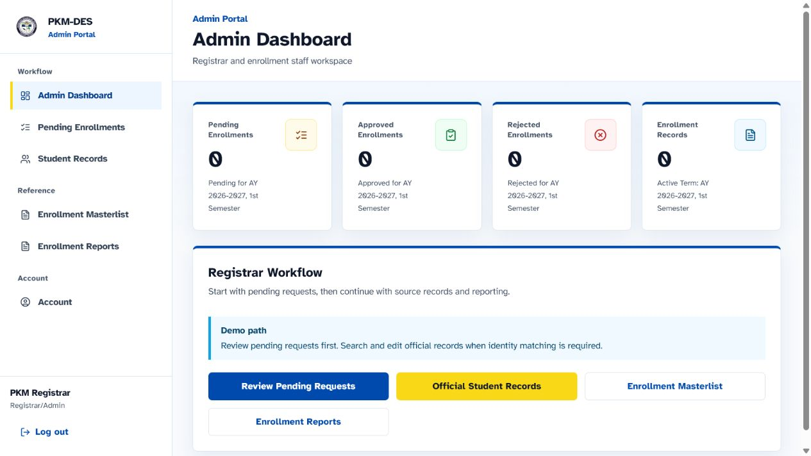
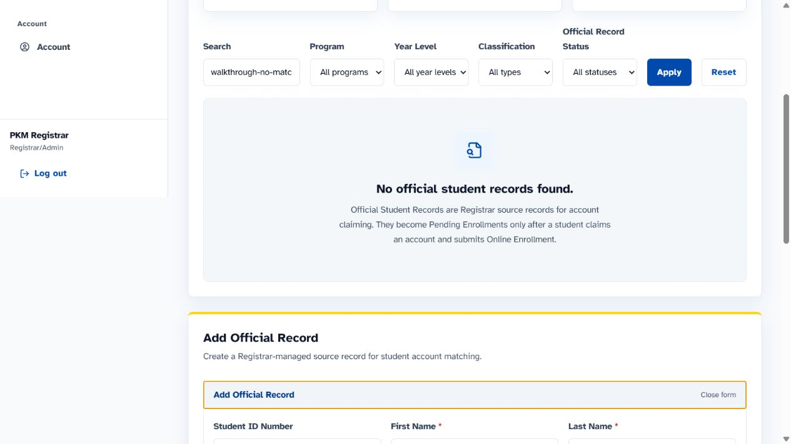
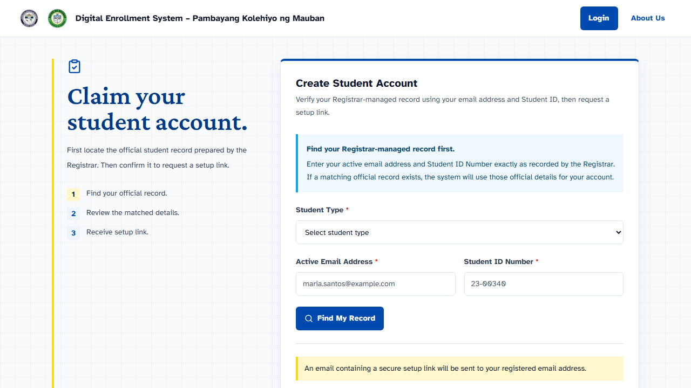
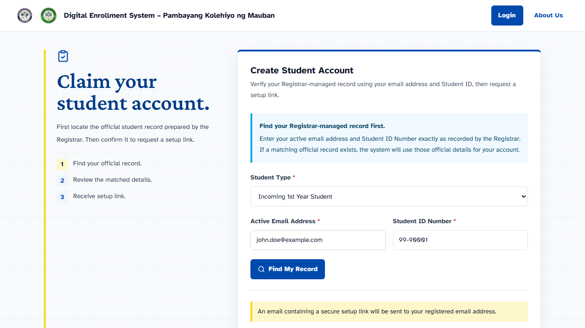
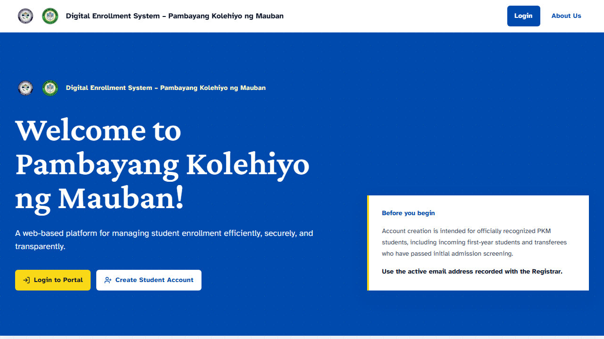

# PKM-DES Research MVP Demo Guide

This guide is for research presenters, advisers, client reviewers, and authorized preview operators. It follows the implemented Registrar-first workflow using fictional or anonymized data.

> PKM-DES is a research-presentation MVP and client preview. It is not an official enrollment service, a production institutional system, or a replacement for the Registrar's current process.

## 1. Before The Demo

### Use a safe preview

- Use the local development server or the authorized client-preview deployment.
- Use only fictional or anonymized records. Never enter real student data.
- Keep active preview credentials private. They are intentionally not printed in this guide.
- Use a dedicated preview or test Supabase project. Never run demo reset or mutating smoke workflows against institutional data.
- Confirm the academic term displayed by the application before presenting it. This feature branch uses `AY 2025-2026`, `2nd Semester`; a deployed preview may show another configured term until it is redeployed.

### Start locally

```bash
npm install
npm run dev
```

Open `http://localhost:3000`. If the port is already in use, use the port printed by the server. Restart Next.js after changing `.env.local`.

For local login, the server must be able to reach the configured Supabase project over HTTPS. The MVP intentionally returns a safe generic authentication message when that request fails.

## 2. Registrar-First Demonstration

The operational flow starts with the Registrar. The Registrar creates or verifies the official student source record before a student can claim an account. Saving an official record does not create an enrollment request.

### Step 1: Registrar signs in

Open `/login?next=/admin/dashboard` and use the authorized private Registrar/Admin credential. Never put the credential in screenshots, presentation slides, or committed documentation.



*Figure 1. Admin Dashboard in the desktop preview. Dashboard counts represent submitted enrollment requests, not official source records.*

### Step 2: Registrar creates the official student record

Open `/admin/students` and select **Add Official Record**. Complete the existing form with fictional or anonymized presentation data, such as:

| Field | Example presentation value |
| --- | --- |
| First Name | John |
| Last Name | Doe |
| Student ID Number | `99-90001` |
| Active Email Address | `john.doe@example.com` |
| Program | Select the intended catalog program |
| Year Level | Select the recorded year level |
| Student Type | Select the recorded student type |

Keep the remaining official-record fields consistent with the fictional record. The form supports multiple catalog programs. Choose the program supplied for the presentation; do not imply that every program has a complete automatic enrollment load.



*Figure 2. Inline Add Official Record form at full desktop width. The committed image is filtered to avoid real-looking record details.*

After saving, the page confirms that the official record was saved and explains the next steps: the student must claim the record, log in, and submit Online Enrollment before appearing in Pending Enrollments, the Masterlist, or dashboard counts.

### Step 3: Student claims the official record

Open `/create-account`. Select the student type and enter both identifiers exactly as the Registrar recorded them:

- Active email address
- Student ID Number

The student must not invent the name, program, year level, or official status. The system looks up the Registrar-managed record, shows a masked read-only summary, and then presents the configured password or setup-link path.



*Figure 3. Account-claim screen before lookup.*

For a presentation-only example, use the fictional John Doe values above. The screenshot below shows the form filled with `john.doe@example.com` and `99-90001`; it is not a claim result and should not be submitted unless the matching fictional official record exists in the dedicated preview database.



*Figure 4. Filled claim form using a readable fictional student example. No active credential is shown.*

If the record is found, review the masked details and continue only when the selected student type agrees with the official record. Email delivery is disabled by default in the research MVP; do not claim that an email was delivered unless an authorized private preview check separately confirms it.

### Step 4: Student logs in and opens the dashboard

Return to `/login` and sign in with the private fictional student credential. The active student account opens `/student/dashboard`.

The dashboard displays the authenticated student information, current enrollment status, and the next status-based action. It does not create an enrollment request by itself.

### Step 5: Student reviews subjects

Open `/student/subjects`.

1. Select a program.
2. Select a year level.
3. Review the tables grouped by year level and semester.
4. Distinguish curriculum references from workbook-derived course offerings.

The program catalog contains multiple programs, and the Subject List includes workbook-derived offerings for several programs. Automatic online enrollment is available only when a complete standard-load configuration exists for the student's program, year level, and active term. Students do not choose individual subjects in this MVP.

### Step 6: Student submits Online Enrollment

Open `/student/enrollment`.

1. Confirm the read-only program, year level, student type, academic year, and semester.
2. Review the configured standard load when one is available.
3. Check **I certify that the information provided is correct**.
4. Select **Submit Enrollment**.

The browser submits only the certification. The server derives the authenticated student, program, year level, student type, active term, and matching subjects. The database creates the enrollment and its subject rows atomically.

Incoming 1st Year, Old, Continuing, and Regular students can use the automatic standard-load path when their program/year/term configuration is complete. Transferee and Irregular Student loads require Registrar-managed subject assignment and are not automatically submitted by this MVP.

### Step 7: Student views the request result

Open `/student/enrollment-status` after submission. The request first appears as **PENDING**. After Registrar review, the student sees the approved or rejected result and any permitted rejection remark.

An approved request can link to the draft registration form. The output is browser-printable, follows the supplied sample as a research draft, and is not an official Certificate of Registration.

### Step 8: Registrar reviews the pending request

Return to `/admin/enrollments`.

1. Select the submitted pending request.
2. Review its academic details and attached subject load.
3. For an applicable current-term Health Record Update requirement, use the status-only verification control. Paper handling remains with the responsible PKM office.
4. Approve when the request and applicable requirement state satisfy the current MVP gate, or reject with the permitted free-text remark.

Approval and rejection are atomic, pending-only review actions. A second concurrent decision cannot overwrite the first decision. Demonstrate this step only with a fictional enrollment request.

### Step 9: Registrar checks the Masterlist and Reports

Open `/admin/masterlist` and `/admin/reports`.

- Use the program, year level, term, review-status, and identity filters.
- Explain that these pages read submitted enrollment requests, not every official source record.
- Use the applied-criteria summary to explain what the report contains.
- Use browser print when a draft report or masterlist output is needed.

An empty report means that no submitted request matched the current criteria; it does not mean that the Registrar has no official records. Reports and masterlist output are research-MVP outputs, not a final institutional export format.

### Step 10: View and print the draft registration form

Open the registration-form view from an enrollment review page or the approved student's status page. Select the browser print command.

The output contains the student and enrollment summary, attached subjects, unit totals, draft disclaimer, and supplied signature labels. It is not an official COR and does not implement digital clearance, payment processing, or electronic signatures.

## 3. Public Pages And Optional Context

Public pages explain the proposed system, but they are not the starting point for the operational workflow. Show them before or after the Registrar-first walkthrough when useful.

### Home

Open `/` to introduce the system name, PKM identity, login action, account-claim action, and the proposed enrollment-process overview.



*Figure 5. Public home page at full desktop width.*

### About Us

Open `/about` to show the source-grounded school identity, vision, mission, goals, contact information, and approved public links.


*Figure 6. About Us page using client-supplied PKM information.*

### Login

Open `/login` to explain that active student accounts route to the Student Portal and active Registrar/Admin accounts route to the Admin Portal.


*Figure 7. Login entry point. Do not type or display credentials while presenting screenshots.*

## 4. Account And Placeholder States

- **Official record saved:** source data exists, but no enrollment request exists yet.
- **No official record found:** the entered email, Student ID, or selected student type does not match the Registrar-managed source record.
- **No configured course load:** the supplied curriculum or offering sources do not provide a complete automatic load for the selected program/year/term.
- **Registrar-managed load:** Transferee and Irregular Student subject assignment is outside the automatic MVP path.
- **No grades available:** grade encoding and official release rules are not implemented.
- **No schedule available:** class assignment data is not encoded in this MVP.
- **No balance records:** payment and assessment data belong to the Finance Office workflow.
- **Draft registration form:** official COR generation is deferred until PKM approves the final template.

## 5. Password Reset And Account Support

Students cannot reset another student's password. If a student loses access, the Registrar may open the matching official record and use the available password-reset control when an exact active student account is linked. The Registrar must provide any temporary credential privately; the student should change it after logging in.

## 6. Reset And Cleanup

Use the guarded fictional-data procedures only when the preview database is dedicated and disposable:

- [Demo reset procedure](DEMO_RESET.md)
- [Private preview credential workflow](PREVIEW_CREDENTIALS.md)
- [Client preview boundary](CLIENT_PREVIEW_DEPLOYMENT.md)
- [Automated workflow smoke tests](DEMO_WORKFLOW_SMOKE_TESTS.md)

The reset tooling is allowlist-based and must stop when it detects a collision with non-demo data. Do not truncate tables or delete unrelated records.

## 7. Troubleshooting

| Symptom | Safe explanation | Next action |
| --- | --- | --- |
| Invalid email or password locally | The local server may not reach Supabase, or its environment may differ from the deployed preview. | Restart Next.js after checking `.env.local`; verify outbound HTTPS access to the configured Supabase URL; never paste keys into chat. |
| No official record found | The email, Student ID, or selected student type does not match the Registrar-managed source record. | Stop and ask the Registrar to verify the official record; do not invent a matching record. |
| Enrollment unavailable | The program/year/term has no complete active standard load, or the classification requires Registrar-managed loading. | Use the Subject List for reference and route the student to the Registrar. |
| Dashboard counts are zero | Counts represent enrollment requests, not official student records. | Claim an official record and submit Online Enrollment in the dedicated preview. |
| Report or masterlist unavailable | The current enrollment query did not load. | Retry after confirming the preview database is reachable; do not interpret the failure as zero records. |

## 8. Presentation Checklist

- [ ] Use a dedicated preview or test database.
- [ ] Confirm fictional data and private credentials before starting.
- [ ] Confirm the active academic term shown in the application.
- [ ] Start with Registrar login and the Admin Dashboard.
- [ ] Create or verify the fictional official student record.
- [ ] Show the student claim flow with matching email and Student ID.
- [ ] Show the student dashboard, Subject List, Online Enrollment, and Enrollment Status when a fictional account is available.
- [ ] Review the submitted request as Registrar and show the resulting Masterlist and Reports.
- [ ] Print the draft registration form and state that it is not an official COR.
- [ ] Call out grades, schedules, balances, email delivery, digital signatures, and clearance routing as placeholders or future work.
- [ ] Reset or dispose of preview data after the presentation according to the guarded procedure.

## Screenshot Boundary

The committed screenshots use a full desktop capture size and cover the Registrar Dashboard, official-record form, public entry, login, and student account-claim steps. Protected student and record-level pages are intentionally described as live walkthrough steps rather than embedded with private or real-looking identities. Capture additional protected screenshots only from a clean fictional preview session, with no credentials or personal data visible.
